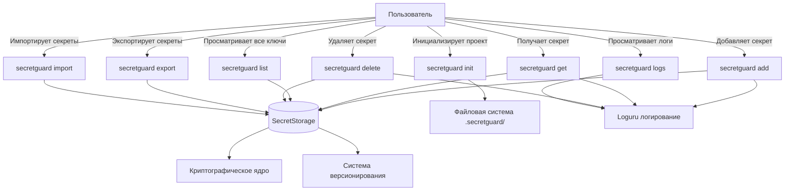
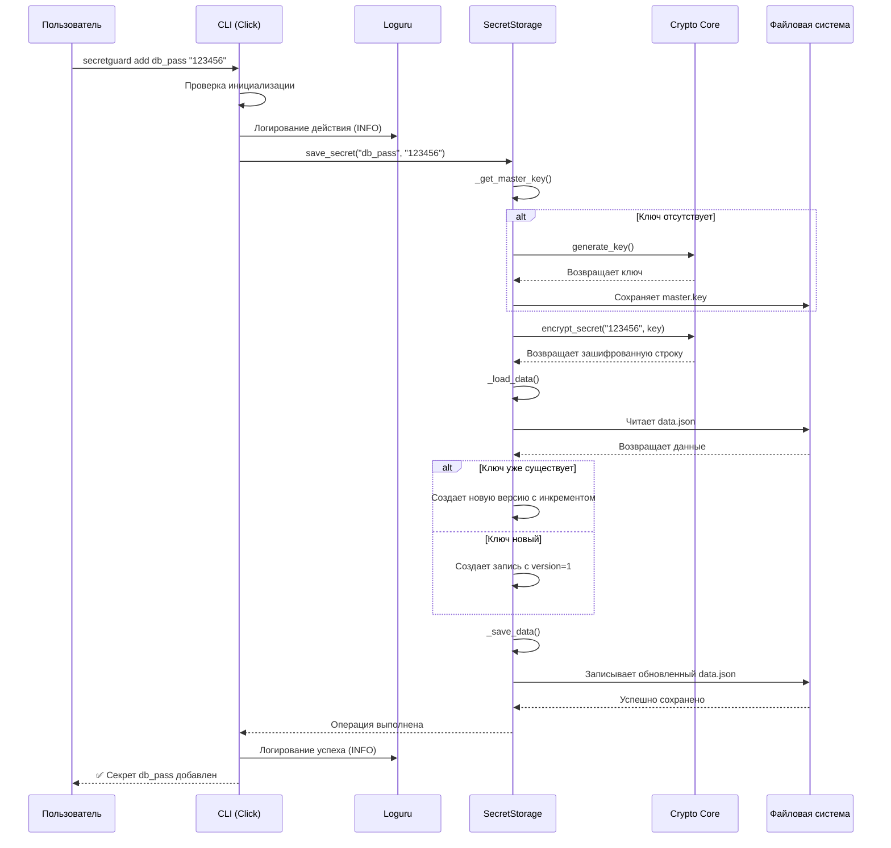

# 📋 ОТЧЕТ ПО КОНТРОЛЬНОЙ ТОЧКЕ №1: ПРОЕКТИРОВАНИЕ И СТАРТ

**Название проекта:** SecretGuard — локальный менеджер секретов для CI/CD

**Команда / Разработчик:**
- Лесовский Егор Сергеевич — DevOps / Инженер по логированию
- Жабенко Илья Алексеевич — Backend-разработчик / Архитектор

---

## 1. Архитектурный план и концепция

**Цель сервиса:**
SecretGuard — это локальный CLI-инструмент для безопасного хранения, управления и версионирования секретов (паролей, токенов, ключей API) в CI/CD-пайплайнах и на локальных машинах разработчиков. Сервис решает проблему безопасного хранения чувствительной информации в открытом виде в репозиториях, предоставляя шифрование и контроль версий.

**Целевой интерфейс:** CLI (Command Line Interface) с поддержкой интерактивных подсказок и цветного вывода.

**Выбранный стек:**
- **Язык программирования:** Python 3.11
- **CLI-фреймворк:** Click
- **Система логирования:** Loguru
- **Криптография:** Cryptography (Fernet)
- **Конфигурация:** PyYAML
- **Линтеры:** Flake8, Black
- **Тестирование:** Pytest
- **Управление окружением:** python-dotenv
- **VCS:** Git, GitHub

---

## 2. Проектирование (UML-диаграммы)

### Диаграмма вариантов использования (Use Case)

### Диаграмма последовательности (Sequence) взаимодействия модулей

---

# 3. Распределение ролей

| Студент | Роль | Зона ответственности |
|---------|------|----------------------|
| Лесовский Егор Сергеевич | DevOps / Инженер по логированию | Создание структуры проекта, настройка Click CLI, интеграция Loguru, конфигурация линтеров (Flake8/Black), реализация пользовательских команд (init, add, get, list, logs, delete), проверка инициализации проекта, обработка ошибок в CLI |
| Жабенко Илья Алексеевич | Backend-разработчик / Архитектор | Проектирование архитектуры, реализация криптографического ядра, разработка класса SecretStorage, версионирование секретов, безопасное удаление, экспорт/импорт секретов, ротация мастер-ключа |

---

# 4. Чек-лист готовности

- [x] Создан новый публичный репозиторий на GitHub.
- [x] Все участники добавлены в репозиторий как соавторы (Collaborators).
- [x] Каждый участник сделал минимум 3 осмысленных коммита (согласно Git-политике).
- [x] Настроено локальное виртуальное окружение, проект запускается в базовом виде.

---

# 5. Результаты работы (ссылки)

| Тип | Ссылка |
|-----|--------|
| Репозиторий | https://github.com/sqdylove/SecretGuard |
| Коммит Егора | https://github.com/sqdylove/SecretGuard/pull/1 |
| Коммит Ильи | https://github.com/sqdylove/SecretGuard/pull/2 |

---

# 6. Выполненные задачи за день

## ✅ Что сделано (общее):

- ✅ Создан репозиторий и настроена структура проекта
- ✅ Установлены все необходимые библиотеки (Click, Loguru, Cryptography, PyYAML, Flake8, Black, Pytest)
- ✅ Настроены Flake8 и Black с едиными правилами форматирования
- ✅ Создан базовый CLI с командой `secretguard --version`
- ✅ Настроено логирование Loguru (запись в файл с ротацией и цветной вывод в консоль)
- ✅ Создан файл `main.py` для запуска приложения
- ✅ Разработана архитектура криптографического ядра проекта
- ✅ Реализованы функции `generate_key`, `load_key`, `save_key`, `encrypt_secret`, `decrypt_secret`
- ✅ Созданы юнит-тесты для всех криптографических функций
- ✅ Написаны UML-диаграммы: Use Case, Sequence и Class diagrams
- ✅ Спроектирована структура класса `SecretStorage` с методами для работы с секретами
- ✅ Определены кастомные исключения (`NeedConfirmError`, `MergeConflictError`)

---

## 👨‍💻 Что сделал Егор Лесовский:

- ✅ Создал репозиторий и настроил структуру проекта
- ✅ Установил все необходимые библиотеки
- ✅ Настроил Flake8 и Black с едиными правилами форматирования
- ✅ Создал базовый CLI с командой `secretguard --version`
- ✅ Настроил логирование Loguru (запись в файл с ротацией и цветной вывод в консоль)
- ✅ Создал файл `main.py` для запуска приложения

---

## 👨‍💻 Что сделал Илья Жабенко:

- ✅ Разработал архитектуру криптографического ядра проекта
- ✅ Реализовал функции `generate_key`, `load_key`, `save_key`, `encrypt_secret`, `decrypt_secret`
- ✅ Создал юнит-тесты для всех криптографических функций
- ✅ Написал UML-диаграммы: Use Case, Sequence и Class diagrams
- ✅ Спроектировал структуру класса `SecretStorage` с методами для работы с секретами
- ✅ Определил кастомные исключения (`NeedConfirmError`, `MergeConflictError`)

---

# 7. Планы на завтра

## 📋 Планы Егора:

- Реализовать команду `secretguard init` для инициализации проекта
- Создать структуру папок `.secretguard/` с конфигом
- Интегрировать генерацию мастер-ключа

## 📋 Планы Ильи:

- Реализовать базовый класс `SecretStorage` с методами `save_secret` и `get_secret`
- Интегрировать криптографическое ядро в `SecretStorage`
- Написать тесты для `SecretStorage`

---

# 📌 ИТОГИ ДНЯ 1

Оба участника успешно завершили первый день практики. Создана основа проекта:

- ✅ Структура репозитория
- ✅ CLI-фреймворк
- ✅ Система логирования
- ✅ Криптографическое ядро
- ✅ Написаны тесты и документация
- ✅ Разработаны UML-диаграммы

**Ссылка на репозиторий:** https://github.com/sqdylove/SecretGuard
